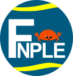

#
<p align="center">
  
  <h3 align="center">fnple</h3>
  <p align="center">The simple fintech platform for people</p>
</p>

---

**`fnple`** is a simple fintech platform.

---

## Project Features
- [ ] Ledger
  - [ ] Account Management
  - [ ] Ledger Entries
- [ ] Transaction Management
  - [ ] Transaction Creation
  - [ ] Transaction Execution
  - [ ] Transaction Cancellation
- [ ] IAM
  - [ ] Registration (Company / Individual)
  - [ ] Management
- [ ] **v1.0** - API
  - [ ] **v1.0** Rest'ish API
  - [ ] **v1.1** GRPC
- [ ] **v1.1** - App
---
## Bootstrap
Add clippy for linting
```bash
rustop components add clippy
cargo clippy
```

Add rustfmt for code formatting
```bash
rustup component add rustfmt
cargo fmt
```

Crate Auditting
```bash
cargo install cargo-audit
cargo audit
```
---
## Components

| Name          | Description          |    Language    |    Type     |
| ------------- | -------------------- | :------------: | :---------: |
| **fnple-cli** | CLI for everything   |       Rust       |     cli     |
| **ledger**     | Management of Habits |       Rust       |   service   |
| **fnple-app** | Fnple App for Users  | Flutter / Dart | ui / mobile |

## Technology

Below is a list of the technology primarily used in this project.

### Backend

https://github.com/stellar/go

- Rust
- grpc, Restful, Graphql
- K8s & Docker
- postgresql
- metabase

### FrontEnd

- Flutter & Dart

---
## Experiments

---

## Emoji Legend

| meaning | emoji              | text                 |
| ------- | ------------------ | -------------------- |
| done    | :heavy_check_mark: | `:heavy_check_mark:` |
| wip     | :construction:     | `:construction:`     |
| note    | :memo:             | `:memo:`             |

---
## Giving Thanks

A Big Shout Out! To the people who worked on the following, the work you have done has aided in my learning of the go language and eco-system.

- project logo inspired by my horrific graphic design and created with <https://krita.org/en/>

---
